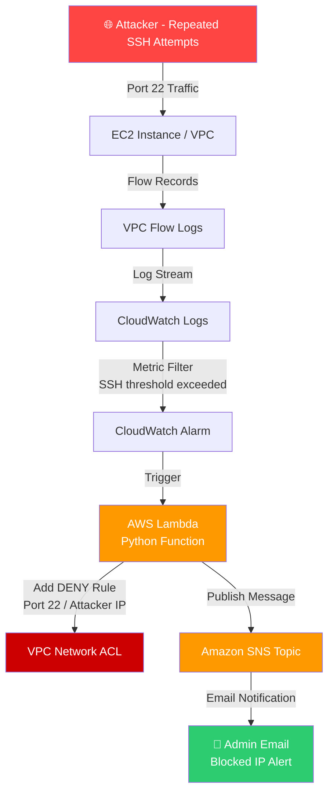

# 🛡️ aws-serverless-bruteforce-detection

> An automated, serverless security system that detects SSH brute-force attacks in real time using AWS VPC Flow Logs and automatically blocks malicious IPs via NACL rules — with instant email alerts via SNS.


---

## 📋 Table of Contents

- [Overview](#-overview)
- [Architecture](#-architecture)
- [How It Works](#-how-it-works)
- [AWS Services Used](#-aws-services-used)
- [Prerequisites](#-prerequisites)
- [Setup & Deployment](#-setup--deployment)
- [IAM Roles & Permissions](#-iam-roles--permissions)
- [Cost Estimate](#-cost-estimate)
- [Screenshots](#-screenshots)
- [Contributing](#-contributing)
- [License](#-license)

---

## 🔍 Overview

This project implements a **fully automated, event-driven security pipeline** on AWS. When an EC2 instance receives repeated SSH login attempts from a suspicious IP, the system:

1. Captures the traffic via **VPC Flow Logs**
2. Streams logs to **CloudWatch Logs**
3. Triggers a **Lambda function** via a CloudWatch metric filter
4. Automatically adds a **DENY rule** to the VPC's NACL
5. Sends an **email alert** via SNS with the blocked IP details

No human intervention required. The attacker is blocked within seconds.

---

## 🏗️ Architecture



---

## ⚙️ How It Works

### Step 1 — VPC Flow Logs Capture Traffic
VPC Flow Logs record all inbound/outbound IP traffic for your VPC. Every SSH (port 22) connection attempt is logged with source IP, destination, protocol, and action.

### Step 2 — CloudWatch Logs Ingestion
Flow logs are streamed to a **CloudWatch Log Group**. A **Metric Filter** counts rejected/accepted SSH attempts per source IP within a rolling time window.

### Step 3 — Lambda Triggered on Threshold
When the SSH attempt count from a single IP exceeds the configured threshold (e.g., 5 attempts), a CloudWatch Alarm fires and invokes the **Lambda function**.

### Step 4 — NACL Rule Added Automatically
The Lambda function:
- Parses the offending IP from the log event
- Connects to the EC2/VPC API
- Inserts a `DENY` rule on **port 22** for that IP in the **Network ACL**
- Uses an auto-incrementing rule number to avoid conflicts

### Step 5 — SNS Email Notification
After blocking the IP, Lambda publishes a message to an **SNS Topic**, which immediately delivers an email to subscribed administrators:

```
Blocked IP 203.76.178.108 after 5 SSH attempts
```

---

## 🧰 AWS Services Used

| Service | Role |
|---|---|
| **VPC Flow Logs** | Captures all network traffic metadata |
| **CloudWatch Logs** | Stores and filters flow log streams |
| **CloudWatch Metrics & Alarms** | Detects SSH attempt threshold breaches |
| **AWS Lambda** | Serverless function — core logic |
| **EC2 Network ACL (NACL)** | Enforces IP-level DENY rules |
| **Amazon SNS** | Sends email alerts to admins |
| **IAM** | Manages permissions for Lambda execution |

---

## ✅ Prerequisites

- AWS Account with admin or sufficient IAM permissions
- VPC with at least one EC2 instance exposed on port 22
- Python 3.11+ (for Lambda runtime)
- AWS CLI configured locally (`aws configure`)
- An email address to subscribe to SNS alerts

---

## 🚀 Setup & Deployment

### 1. Enable VPC Flow Logs

```bash
aws ec2 create-flow-logs \
  --resource-type VPC \
  --resource-ids vpc-xxxxxxxx \
  --traffic-type ALL \
  --log-destination-type cloud-watch-logs \
  --log-group-name /aws/vpc/flowlogs \
  --deliver-logs-permission-arn arn:aws:iam::YOUR_ACCOUNT_ID:role/VPCFlowLogsRole
```

### 2. Create CloudWatch Metric Filter

```bash
aws logs put-metric-filter \
  --log-group-name /aws/vpc/flowlogs \
  --filter-name SSHBruteForce \
  --filter-pattern '[version, account, eni, source, destination, srcport, destport="22", protocol, packets, bytes, windowstart, windowend, action="REJECT", flowlogstatus]' \
  --metric-transformations \
      metricName=SSHRejectCount,metricNamespace=VPCFlowLogs,metricValue=1
```

### 3. Create SNS Topic & Subscribe Email

```bash
# Create topic
aws sns create-topic --name GuardDuty-Security-Alerts

# Subscribe your email
aws sns subscribe \
  --topic-arn arn:aws:sns:ap-south-1:YOUR_ACCOUNT_ID:GuardDuty-Security-Alerts \
  --protocol email \
  --notification-endpoint your@email.com
```

> ⚠️ Confirm the subscription from your email inbox before continuing.

### 4. Deploy Lambda Function

```bash
# Zip the function
zip function.zip lambda_function.py

# Create Lambda
aws lambda create-function \
  --function-name SSHBruteForceBlocker \
  --runtime python3.11 \
  --role arn:aws:iam::YOUR_ACCOUNT_ID:role/LambdaSSHBlockerRole \
  --handler lambda_function.lambda_handler \
  --zip-file fileb://function.zip \
  --environment Variables="{SNS_TOPIC_ARN=arn:aws:sns:ap-south-1:YOUR_ACCOUNT_ID:GuardDuty-Security-Alerts,NACL_ID=acl-xxxxxxxx,THRESHOLD=5}"
```

### 5. Create CloudWatch Alarm to Trigger Lambda

```bash
aws cloudwatch put-metric-alarm \
  --alarm-name SSHBruteForceAlarm \
  --metric-name SSHRejectCount \
  --namespace VPCFlowLogs \
  --statistic Sum \
  --period 60 \
  --threshold 5 \
  --comparison-operator GreaterThanOrEqualToThreshold \
  --evaluation-periods 1 \
  --alarm-actions arn:aws:lambda:ap-south-1:YOUR_ACCOUNT_ID:function:SSHBruteForceBlocker
```

### 6. Grant CloudWatch Permission to Invoke Lambda

```bash
aws lambda add-permission \
  --function-name SSHBruteForceBlocker \
  --statement-id AllowCloudWatch \
  --action lambda:InvokeFunction \
  --principal lambda.alarms.cloudwatch.amazonaws.com \
  --source-arn arn:aws:cloudwatch:ap-south-1:YOUR_ACCOUNT_ID:alarm:SSHBruteForceAlarm
```

---

## 🔐 IAM Roles & Permissions

### Lambda Execution Role — `LambdaSSHBlockerRole`

Attach the following inline policy to the Lambda execution role:

```json
{
  "Version": "2012-10-17",
  "Statement": [
    {
      "Sid": "AllowNACLWrite",
      "Effect": "Allow",
      "Action": [
        "ec2:CreateNetworkAclEntry",
        "ec2:DescribeNetworkAcls"
      ],
      "Resource": "*"
    },
    {
      "Sid": "AllowSNSPublish",
      "Effect": "Allow",
      "Action": "sns:Publish",
      "Resource": "arn:aws:sns:ap-south-1:YOUR_ACCOUNT_ID:GuardDuty-Security-Alerts"
    },
    {
      "Sid": "AllowCloudWatchLogs",
      "Effect": "Allow",
      "Action": [
        "logs:CreateLogGroup",
        "logs:CreateLogStream",
        "logs:PutLogEvents"
      ],
      "Resource": "arn:aws:logs:*:*:*"
    }
  ]
}
```

### VPC Flow Logs Role — `VPCFlowLogsRole`

```json
{
  "Version": "2012-10-17",
  "Statement": [
    {
      "Effect": "Allow",
      "Action": [
        "logs:CreateLogGroup",
        "logs:CreateLogStream",
        "logs:PutLogEvents",
        "logs:DescribeLogGroups",
        "logs:DescribeLogStreams"
      ],
      "Resource": "*"
    }
  ]
}
```

Trust policy (allows VPC Flow Logs service to assume the role):

```json
{
  "Version": "2012-10-17",
  "Statement": [
    {
      "Effect": "Allow",
      "Principal": { "Service": "vpc-flow-logs.amazonaws.com" },
      "Action": "sts:AssumeRole"
    }
  ]
}
```

---

## 💰 Cost Estimate

All services used fall within the **AWS Free Tier** for low-to-moderate traffic. Below is a rough estimate for production workloads:

| Service | Free Tier | Beyond Free Tier |
|---|---|---|
| **VPC Flow Logs** | — | ~$0.50 / GB ingested |
| **CloudWatch Logs** | 5 GB/month | ~$0.50 / GB after |
| **CloudWatch Alarms** | 10 alarms free | ~$0.10 / alarm/month |
| **Lambda** | 1M requests/month | ~$0.20 / 1M requests |
| **SNS Email** | 1,000 emails/month free | ~$2.00 / 100K after |
| **NACL Rules** | Free | Free |

> 💡 For a typical low-traffic environment, this solution runs at **near-zero cost**.

---

## 📸 Screenshots

### SNS Email Alert — IP Blocked Notification

> Real alert received after the system detected and blocked `203.76.178.108` following 5 failed SSH attempts.


---

### NACL Deny Rules — Blocked IPs

> Network ACL rules automatically inserted by Lambda. Multiple IPs blocked across sessions.


---

## 🤝 Contributing

Pull requests are welcome! For major changes, please open an issue first to discuss what you'd like to change.

1. Fork the repository
2. Create your feature branch (`git checkout -b feature/your-feature`)
3. Commit your changes (`git commit -m 'Add some feature'`)
4. Push to the branch (`git push origin feature/your-feature`)
5. Open a Pull Request

---

## 📄 License

This project is licensed under the [MIT License](LICENSE).

---

<div align="center">

**Built with ❤️ on AWS Serverless**

⭐ Star this repo if it helped you secure your infrastructure!

</div>
